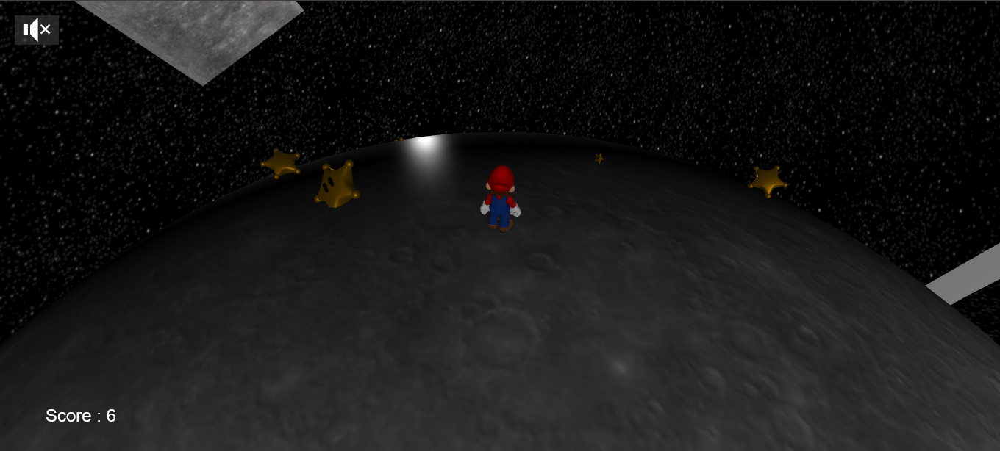

# BabylonGame

# Participant 
Grac Matteo

## Features

### 1. **Player Mechanics**
- **Movement**: The player can move in all directions using keyboard or gamepad (dualshock4) input.
- **Jumping**: The player can jump, with gravity applied to simulate a kind of physics.
- **Planetary Gravity**: The player is affected by the gravity of the planet, allowing for movement on many surfaces.(sphere,cube,cylinder)
- **Camera Control**: The camera follows the player and adjusts its orientation based on the planet's surface.(adjust to the current Upvector of the player)

### 2. **Planet System**
- **Handleling multiple Planet Shape**: The game features a spherical planet that the player can walk on.


### 3. **Star Collection System**
- **Stars (Etoiles)**: Stars spawn dynamically around the planet.
- **Oscillation and Rotation**: Stars oscillate and rotate to create a visually appealing effect.
- **Collection**: The player can collect stars, which updates the player score.



### 4. **Debugging Tools**
- **Debug Mode and debugDraw**: Enables additional visual aids, such as axes and raycasts, ellipsoid lines, to help with development and testing.
- **Babylon.js Inspector**: The Babylon.js Inspector can be enabled for real-time scene debugging.

### 5. **Gamepad Support**
- **DualShock Gamepad**: The game supports gamepad input for movement.
- **Analog Stick Input**: Both left and right analog sticks are used for movement and camera control.

## Getting Started


## Controls
- **movements** : zqsd or wasd or analogstick
- **jump** : space bar or crossButton
- **super jump** : left shift or squareButton

## WebSite link to play the game

- https://babylon-game-umber.vercel.app/


### Prerequisites
- Node.js and npm installed on your system.

### Installation
1. Clone the repository.
2. Install dependencies:
   ```bash
   npm install